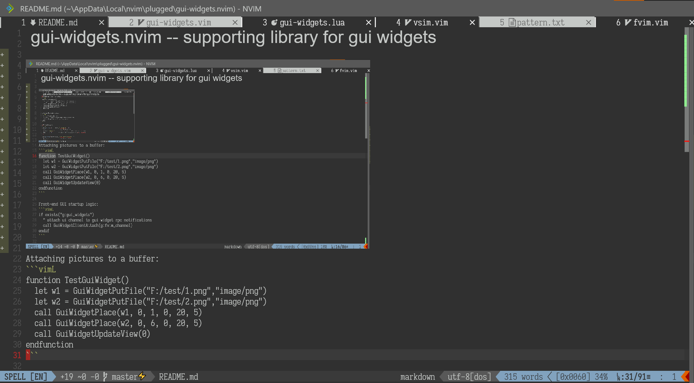

# gui-widgets.nvim -- supporting library for gui widgets





## For Front-End Devs:

Front-end GUI startup logic:
```vimL
if exists("g:gui_widgets")
  " attach ui channel to gui widget rpc notifications
  call GuiWidgetClientAttach(g:fvim_channel)
endif
```

RPC notifications:
```lua
vim.rpcnotify(clientChannel,"GuiWidgetPut", {
  id = 123;                -- the gui widget id
  mime = "image/png";      -- the mime data, client chooses how to present
  data = { ... };          -- binary data, serializes to str8 in msgpack
})

vim.rpcnotify(clientChannel, "GuiWidgetUpdateView", {
  buf = 5;                 -- the updated buffer
  widgets = {
    { 1, 123, 5, 10 },     -- [mark_id, res_id, width, height] tuple
    { 2, 234, 1, 5,        -- can have an opt dictionary
      { ['key'] = value; ... } 
    }
  }
})
```

A front-end needs to listen to these two notifications -- `GuiWidgetPut` pushes
visual resource data to the front-end, and `GuiWidgetUpdateView` sends a list
of "placements". A placement associates an extmark with a resource id, and
provides display options for a widget (width, height, mouse events etc.).
In addition, the UI client should keep track of the on-screen coordinates for
the extmarks, so that the widgets can be aligned, clipped, scrolled, clicked,
etc. etc. in the grid. The idea of this paradigm is that plugins can frequently
update the placements of ui elements for a buffer without sending the large ui
resource files(images).

When a plugin calls `GuiWidgetPut`, it will be sent right away to the client
after it's loaded from the path. The client may use a LRU cache to evict
resources, and use `GuiWidgetRequest` later if the cache misses. Note,
`gui-widgets` does not comply to the MIME standards so it may as well send a
mime 'image/*'...

Some MIME types worth implementing are:

- `image/*` for bitmap images. A lot of UI frameworks can automatically detect
  the actual format.
- `image/svg` for vector images and math formulas.
- `text/plain` for virtual text -- the benefit is custom font/color/style, like
  markdown headers.
- Suggestions? :)

## For Plugin Devs

`local gui = require'gui-widgets'` to begin with. 

```lua
-- load a resource file and push it to the frontend:
local img1 = gui.put_file('/foo/bar/baz.jpg', 'image/*')
-- automatically download from the web too:
local img2 = gui.put_file('http://test-image.png', 'image/*')
-- push raw data 
local txt1 = gui.put_data('Hello world!', 'text/plain')
-- delete one or more resources, and notify the client:
gui.del(txt1)
-- place a widget in a buffer 
-- (id, bufnr, row, col, w, h, opt)
local mark1 = gui.place(img1, buf, 0, 0, 10, 5)
-- send the updated placements to the client
gui.update_view(buf)
-- clear all resources and placements for a buffer
gui.clear_view(buf)
```

See [the implementation](https://github.com/yatli/gui-widgets.nvim/blob/master/lua/gui-widgets.lua)
`refresh_mkd` automatically generates UI elements for headers and images.

A thin vimL layer is also provided:
```vimL
" Attaching pictures to a buffer:
function TestGuiWidget()
  let w1 = GuiWidgetPutFile("F:/test/1.png","image/png")
  let w2 = GuiWidgetPutFile("F:/test/2.png","image/png")
  call GuiWidgetPlace(w1, 0, 1, 0, 20, 5)
  call GuiWidgetPlace(w2, 0, 6, 0, 20, 5)
  call GuiWidgetUpdateView(0)
endfunction
```

## Placement options
```lua
  gui.place(w1, 0, 0, 0, 8, 2, {
    ['clicked-widget']=w2;                            -- displays w2 when clicked
    ['clicked-exec']='silent call VsimToggleColor()'; -- callback on clicked
    ['released-widget']=w1;                           -- displays w1 when released
    ['halign']='center';                              -- left/center/right/stretch
    ['valign']='center';                              -- top/center/bottom/stretch
    ['stretch']='uniform';                            -- none/uniform/uniformfill
  })

  gui.place(w3, 0, 2, 0, 20, 2, {
    ['text-font']='Arial';
    ['text-scale']=2;                                 -- relative to guifont size
    ['text-hlid']='Normal';                           -- semantic highlight group name
    ['hide']='cursor';                                -- none/cursor/cursorline
  })
```

## Animation

First put all the frames so the client has them.
Then, refer to the frames by the gui widget ids to update the frame.

## TODO

- `GuiWidgetRequest` should be rpcnotify, not a function -- so it can be used in redraw.
- win_viewport does not have horizontal scroll information and sign column/number column sizes...
    - see https://github.com/neovim/neovim/pull/15674
